# DevSecOps CI/CD Pipeline Enhanced

This project demonstrates an enterprise-grade **DevSecOps CI/CD pipeline** built for the **Resume Matcher** platform, integrating security, quality, testing, supply-chain protection, automated reporting, and multi-architecture container distribution from development through production release.

The enhanced implementation extends the CI/CD lifecycle with **cryptographic commit signing and verification, secret detection with Gitleaks, static analysis with SonarCloud, vulnerability scanning with OWASP Dependency-Check and Trivy, automated unit and E2E testing, performance validation with k6, cryptographic container image signing with Cosign, SBOM generation with Syft, attestation verification, and automated HTML reporting**.

The final release workflow produces verifiable container artifacts for both **Docker Hub** and **GitHub Container Registry (GHCR)**.

---

## Access the Walkthrough

[](https://www.youtube.com/embed/ApellkNGW-I?si=WgOHZJnp1O2Atu8q)

[Watch the Resume Matcher DevSecOps Pipeline Walkthrough](https://www.youtube.com/embed/ApellkNGW-I?si=WgOHZJnp1O2Atu8q)

---

## 🛠 Enhanced DevSecOps Strategy

<div align="center">
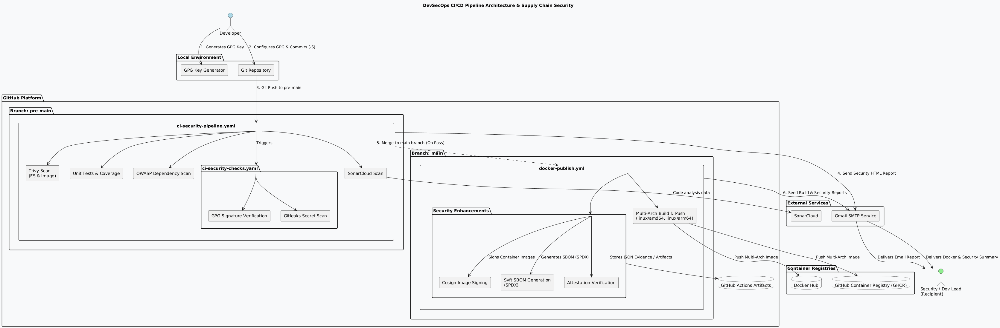
</div>


The enhanced pipeline is organized into three major implementation stages:

1. **Commit Signing Setup**
2. **Security Scanning, Secret Detection & Commit Verification**
3. **Image Build, Push, Signing & SBOM Generation**

These stages extend the existing CI/CD lifecycle by adding verifiable software supply-chain security and machine-readable security evidence to the production release process.

<div align="center">
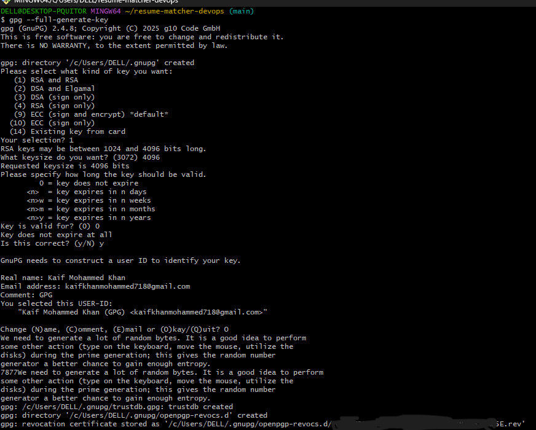
</div>

---

# Step 1: Commit Signing Setup

The pipeline infrastructure is organized around dedicated GitHub branches, with **`pre-main`** used for security and validation workflows and **`main`** representing the production release path.

Automated notification secrets are configured using a dedicated **Google App Password**, allowing GitHub Actions to securely dispatch security and QA reports directly to Gmail.

Repository notification secrets include:

```text
# GitHub Repository Secrets Configuration
EMAIL_USER=your-gmail-address
EMAIL_PASS=your-google-app-password
```

In addition to automated reporting, this stage introduces **cryptographic Git commit signing using GPG**.

Signed commits provide a mechanism for verifying that commits originated from the expected signing identity and have not been altered after signing.

### Generate a GPG Key

```bash
gpg --full-generate-key
```

### List Secret Keys

```bash
gpg --list-secret-keys --keyid-format LONG
```

### Configure Git Commit Signing

```bash
git config --global user.signingkey <YOUR_KEY_ID>
git config --global commit.gpgsign true
```

### Export the Public Key

```bash
gpg --armor --export <YOUR_KEY_ID>
```

The exported public key is added to GitHub under:

```text
Settings → SSH and GPG keys
```

Once configured, commits pushed to the repository can display GitHub's **Verified** badge, providing an additional layer of authenticity for the source-code supply chain.

<div align="center">


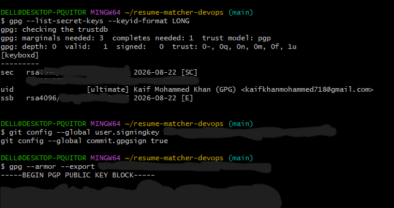
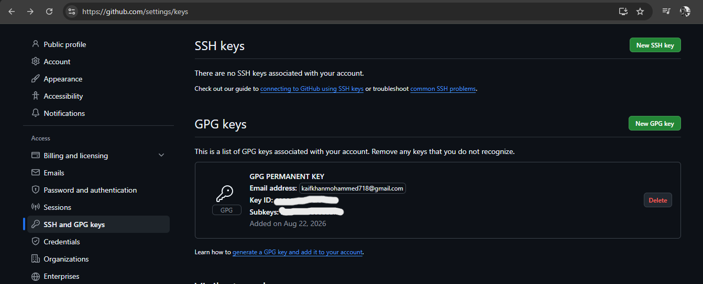


</div>

---

# Step 2: Security Scanning, Secret Detection & Commit Verification

The enhanced security layer introduces a dedicated child workflow:

```text
ci-security-checks.yaml
```

This workflow is integrated into:

```text
ci-security-pipeline.yaml
```

The workflow adds two important supply-chain controls:

- **Gitleaks** for hardcoded-secret detection
- **GPG commit signature verification** for commit authenticity

These controls execute alongside the existing security and quality validation process.

### Security Workflow

The security lifecycle combines:

- Gitleaks secret detection
- GPG commit verification
- SonarCloud static analysis
- Trivy security scanning
- Automated HTML report generation
- Email notification

The goal is to ensure that source-code authenticity and secret hygiene are continuously validated alongside traditional vulnerability and code-quality analysis.

The local:

```text
premain.sh
```

automation triggers the validation workflow and prompts the configured GPG signing process during commits.

After execution, the workflow provides confirmation of:

- Commit authenticity
- Secret detection status
- Security scan results
- Automated HTML reporting

The resulting security reports are delivered to Gmail alongside the existing SonarCloud and Trivy results.

<div align="center">

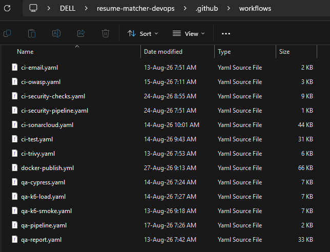
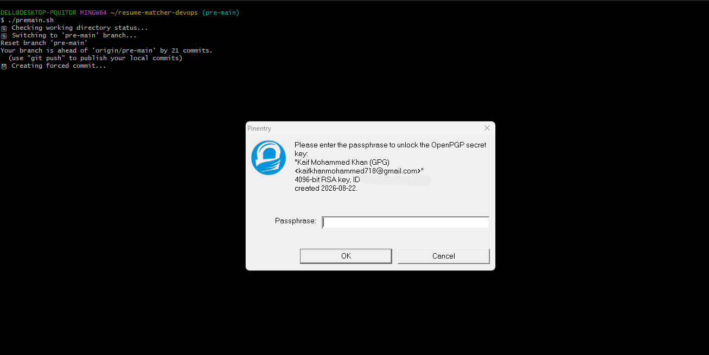
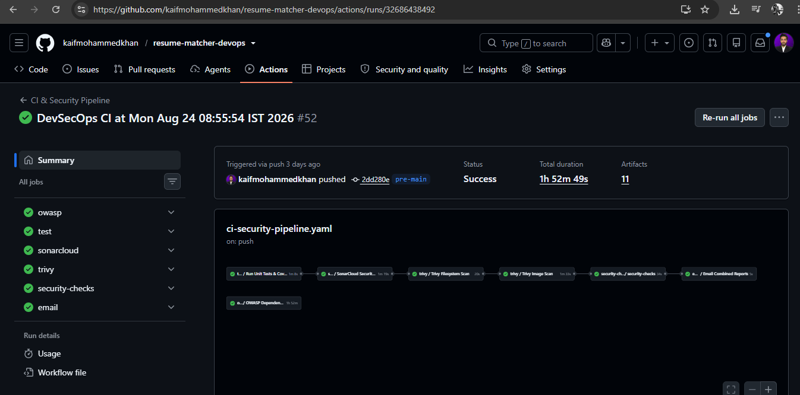
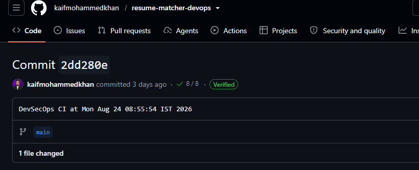
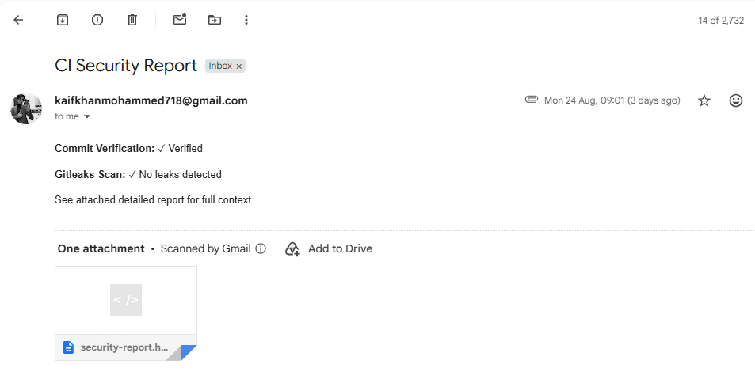
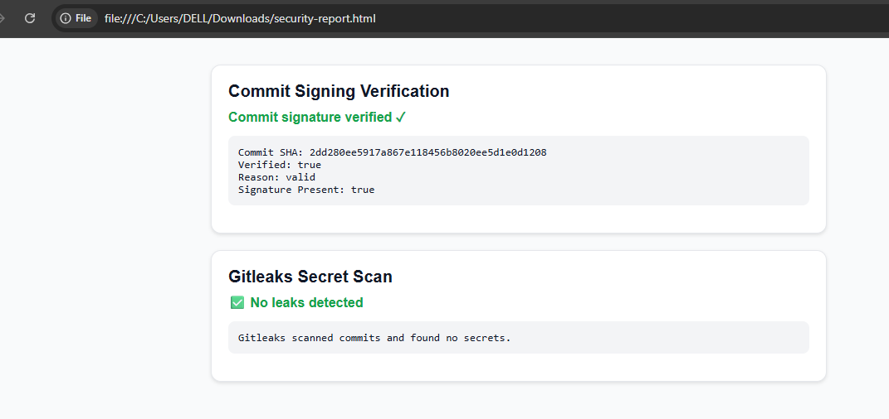

</div>

---

# Step 3: Image Build, Push, Signing & SBOM Generation

The production pipeline on the **`main`** branch extends the existing image build and distribution process with additional software supply-chain security controls.

After the vulnerability-free `pre-main` branch is merged into `main`, the:

```text
docker-publish.yaml
```

workflow builds and publishes the production container images.

The enhanced workflow performs:

- Multi-architecture container builds
- Docker Hub publication
- GHCR publication
- Immutable image-digest identification
- Cosign image signing
- Syft SBOM generation
- Attestation verification
- Machine-readable evidence preservation
- Automated HTML reporting

### Multi-Architecture Build

Production images are built for:

```text
linux/amd64
linux/arm64
```

This allows the same production release to support multiple CPU architectures.

### Container Image Signing

After the images are published, **Cosign** cryptographically signs the container images.

The signing process anchors the image identity to its **immutable digest**, providing stronger supply-chain verification than relying only on mutable tags such as:

```text
latest
```

This allows the published artifact to be independently associated with the exact image digest that was built and released.

### SBOM Generation

**Syft** generates Software Bill of Materials (SBOM) documents for the published images.

The SBOMs provide machine-readable information about the software components contained within the production images.

The generated SBOMs use the **SPDX** format.

### Attestation Verification

The pipeline also preserves and verifies attestation records associated with the released images.

Machine-readable evidence is retained as GitHub Actions artifacts, allowing the generated security evidence to be independently inspected.

The preserved evidence includes:

```text
Cosign JSON
SBOM JSON
Attestation JSON
```

### Automated Release Reporting

The production workflow generates two HTML reports:

```text
Docker Build & Push Report
Docker Security Report
```

The reports provide visibility into:

- Multi-architecture image builds
- Docker Hub publication
- GHCR publication
- Image signing
- SBOM generation
- Attestation verification
- Release metadata

The reports are automatically delivered through email using the configured notification system.

<div align="center">

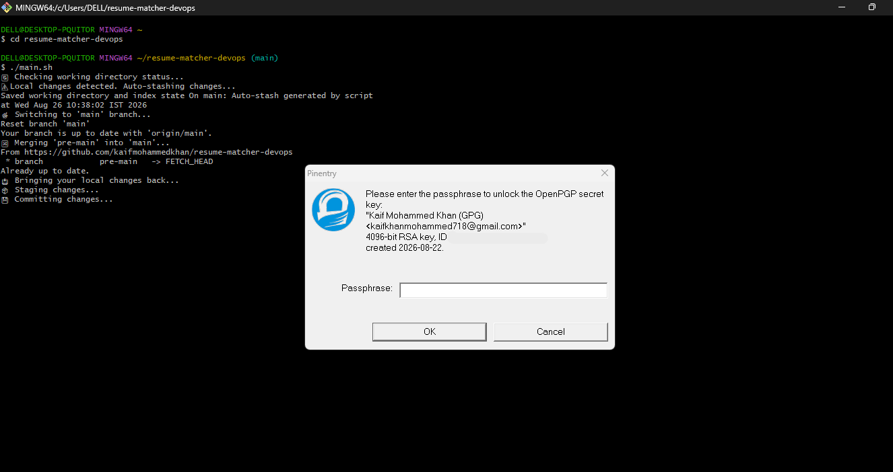
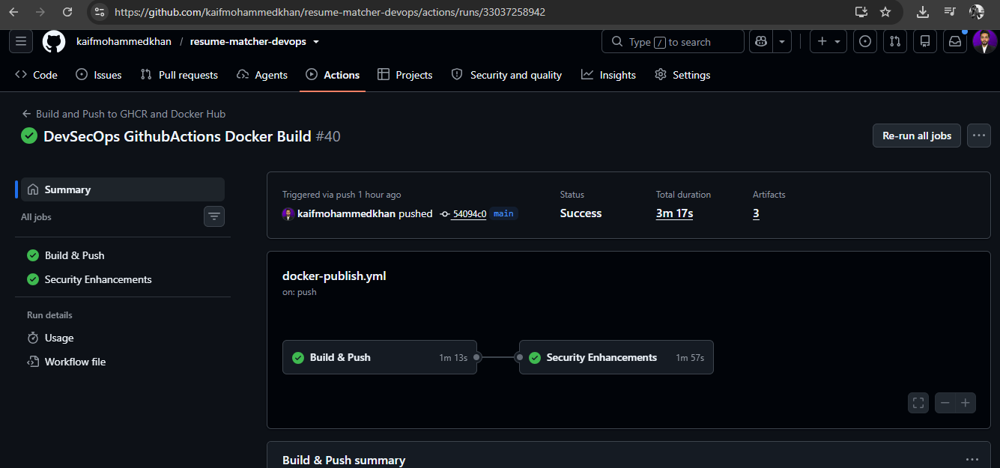
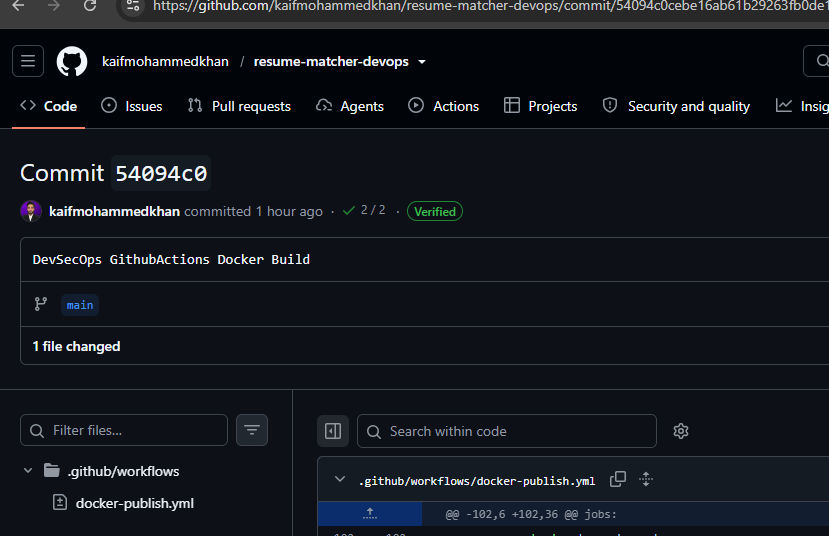
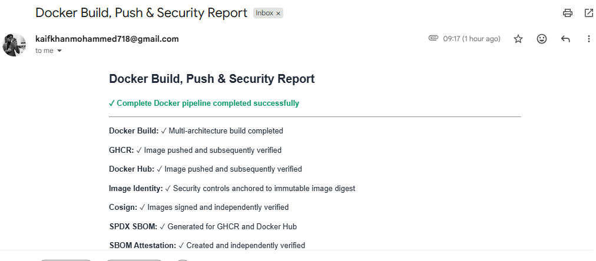
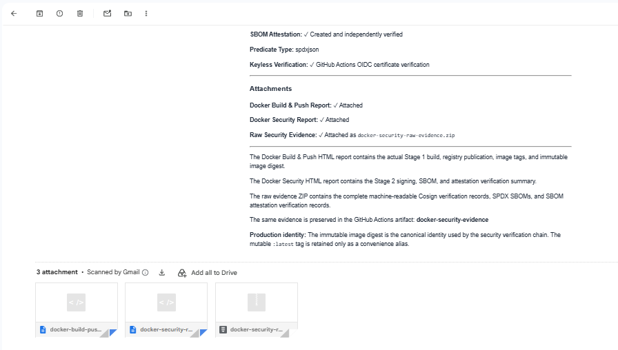
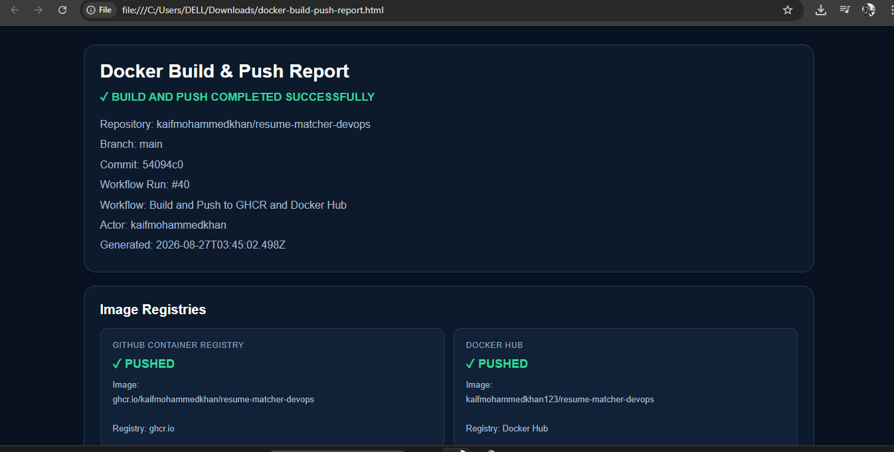


</div>

---

# 🔄 End-to-End Enhanced Pipeline Flow

```text
Developer Changes
       │
       ▼
   pre-main
       │
       ├── GPG Commit Signing
       │
       ├── Commit Signature Verification
       │
       ├── Gitleaks Secret Detection
       │
       ├── SonarCloud Analysis
       │
       ├── Trivy Security Scanning
       │
       ├── OWASP Dependency Scanning
       │
       ├── Jest Unit Testing
       │
       ├── Cypress E2E Testing
       │
       ├── k6 Smoke Testing
       │
       └── k6 Load Testing
              │
              ▼
       Security / Quality
             Gates
              │
              ▼
        Validation Passed
              │
              ▼
            main
              │
              ▼
     Multi-Architecture Build
        ┌───────────────┐
        │               │
        ▼               ▼
      GHCR          Docker Hub
        │               │
        └───────┬───────┘
                │
                ▼
       Immutable Digest
                │
                ▼
         Cosign Signing
                │
                ▼
          Syft SBOM
          Generation
                │
                ▼
       Attestation Verify
                │
                ▼
      Machine-Readable Evidence
                │
                ▼
       HTML Release Reports
                │
                ▼
        Email Notification
```

---

# 🔐 DevSecOps Security Controls

The enhanced pipeline introduces multiple layers of protection across the software supply chain.

| Security Layer | Technology | Purpose |
|---|---|---|
| Commit Authenticity | GPG | Cryptographically sign and verify Git commits |
| Secret Detection | Gitleaks | Detect hardcoded credentials and secrets |
| Static Analysis | SonarCloud | Identify code-quality and security issues |
| Dependency Security | OWASP Dependency-Check | Identify vulnerable third-party dependencies |
| Filesystem Security | Trivy | Scan source files and dependencies |
| Container Security | Trivy | Scan container images for vulnerabilities and misconfigurations |
| Image Signing | Cosign | Cryptographically sign production container images |
| SBOM | Syft | Generate software component inventories |
| Attestation | GitHub Actions / Cosign | Verify and preserve build provenance evidence |
| Registry Security | GHCR / Docker Hub | Distribute production container artifacts |
| Reporting | Nodemailer / Gmail | Deliver automated security and release reports |

---

# 🧰 DevSecOps Toolchain

| Category | Technology |
|---|---|
| Source Control | Git / GitHub |
| Branch Management | `pre-main` / `main` |
| Commit Signing | GPG |
| Secret Detection | Gitleaks |
| CI/CD | GitHub Actions |
| Static Analysis | SonarCloud |
| Dependency Security | OWASP Dependency-Check |
| Filesystem Security | Trivy |
| Container Security | Trivy |
| Unit Testing | Jest |
| E2E Testing | Cypress |
| Performance Testing | k6 |
| API Mocking | WireMock |
| Container Build | Docker Buildx |
| Image Signing | Cosign |
| SBOM Generation | Syft |
| Container Registry | GitHub Container Registry |
| Container Registry | Docker Hub |
| Release Reporting | Nodemailer / Gmail |
| Automation | Bash |

---

# 📦 Supply Chain Security

The enhanced pipeline strengthens the software supply chain across multiple stages.

### Source Integrity

GPG signing establishes cryptographic identity for Git commits and allows GitHub to display verified commits.

### Secret Hygiene

Gitleaks continuously checks the repository for accidentally committed credentials, tokens, and other sensitive values.

### Dependency & Container Security

SonarCloud, OWASP Dependency-Check, and Trivy provide multiple layers of vulnerability and quality analysis before production release.

### Artifact Integrity

Production images are identified using their immutable digests and cryptographically signed using Cosign.

### Software Transparency

Syft generates SPDX SBOMs describing the software components included in the production container images.

### Verifiable Evidence

Cosign verification, SBOM documents, and attestation records are preserved as machine-readable artifacts.

### Human-Readable Reporting

HTML security and release reports are generated and delivered through email, providing an accessible summary of the production release.

---

# 📊 Automated Evidence & Reporting

The pipeline produces both human-readable and machine-readable security evidence.

### HTML Reports

```text
Docker Build & Push Report
Docker Security Report
```

These reports summarize the production build, registry publication, signing, SBOM generation, and attestation verification.

### Machine-Readable Evidence

The pipeline preserves:

```text
Cosign JSON
SBOM JSON
Attestation JSON
```

These artifacts can be independently inspected rather than relying exclusively on the rendered HTML reports.

This provides a stronger evidence model for the production release because the underlying security metadata remains available for verification.

---

# 🚀 Production Release Flow

The production release is performed through the `main` branch after validation of the `pre-main` branch.

The release process follows the general flow:

```bash
git checkout main
git merge pre-main
git push origin main
```

The production workflow then performs:

```text
1. Build production images
2. Build linux/amd64 image
3. Build linux/arm64 image
4. Push images to GHCR
5. Push images to Docker Hub
6. Resolve immutable image digests
7. Sign images with Cosign
8. Generate SPDX SBOMs with Syft
9. Verify attestations
10. Preserve machine-readable evidence
11. Generate HTML reports
12. Send release reports through email
```

---

# 📝 Notes

- **GPG** provides cryptographic commit signing and source authenticity verification.
- **Gitleaks** detects hardcoded secrets before they enter the production supply chain.
- **SonarCloud** performs static analysis and code-quality/security analysis.
- **OWASP Dependency-Check** identifies vulnerable third-party dependencies.
- **Trivy** scans filesystems and container images for vulnerabilities and misconfigurations.
- **Jest** provides automated unit testing and coverage.
- **Cypress** validates end-to-end application behavior.
- **WireMock** isolates external API dependencies during QA.
- **k6** validates smoke-test reliability and sustained load performance.
- **Docker Buildx** enables multi-architecture container builds.
- **Cosign** provides cryptographic container image signing.
- **Syft** generates SPDX Software Bill of Materials.
- **Attestation verification** provides additional supply-chain evidence.
- **GHCR and Docker Hub** distribute the production container images.
- **Nodemailer/Gmail** delivers automated HTML security and release reports.
- Machine-readable security evidence is preserved as GitHub Actions artifacts.
- Production image identity is anchored to immutable image digests rather than relying solely on mutable tags.

---

# 🎯 Outcome

The enhanced Resume Matcher DevSecOps pipeline extends traditional CI/CD into a more verifiable software supply-chain workflow.

Instead of stopping at source-code testing and vulnerability scanning, the pipeline establishes controls across the complete delivery chain:

```text
Source
  ↓
Signed Commits
  ↓
Secret Detection
  ↓
Static Analysis
  ↓
Dependency Scanning
  ↓
Filesystem / Container Scanning
  ↓
Automated Testing
  ↓
Quality & Security Gates
  ↓
Production Build
  ↓
Multi-Architecture Images
  ↓
Immutable Image Digest
  ↓
Cosign Image Signing
  ↓
SBOM Generation
  ↓
Attestation Verification
  ↓
Machine-Readable Evidence
  ↓
HTML Release Reporting
  ↓
GHCR + Docker Hub
```

The result is a **security-focused, test-driven, auditable, and verifiable DevSecOps release process** in which source authenticity, secret hygiene, application quality, dependency security, container security, artifact integrity, software transparency, and release evidence are integrated into a single automated delivery lifecycle.

---

<div align="center">

**© 2026 Kaif. All rights reserved.**

</div>
